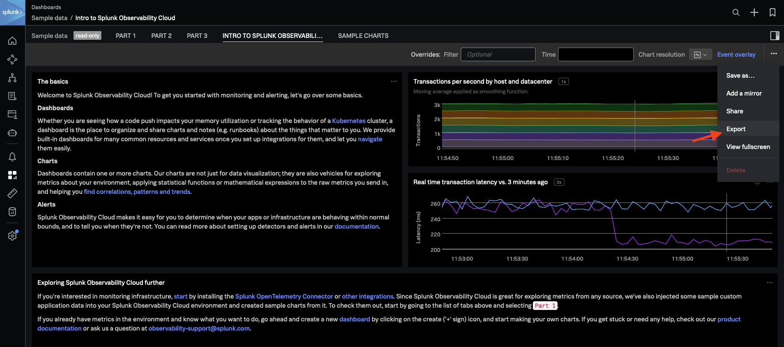

# Example

For this example we've exported one of the example data dashboard from SignalFX and we are using the dasboard_converter module to convert it into terraform ready parameters as inputs for this module.

You can find the export button in the top right corner of the dashboard.

